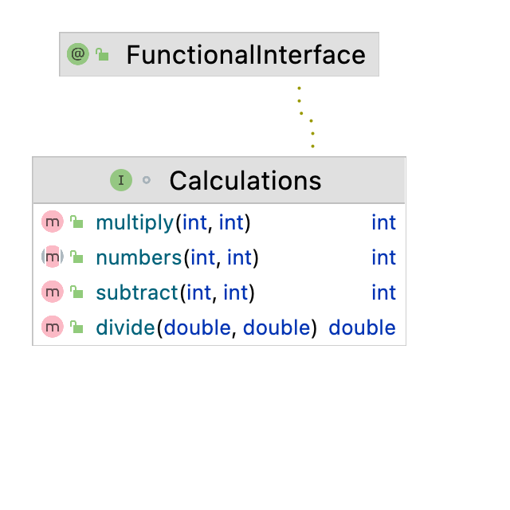

#***Functional Interface***
___
@FunctionalInterface

 An informative annotation type used to indicate that an interface type declaration is intended to be a functional
 interface as defined by the Java Language Specification. Conceptually, a functional interface has exactly one
 abstract method. Since default methods have an implementation, they are not abstract. If an interface declares an
 abstract method overriding one of the public methods of java.lang.Object, that also does not count toward the
 interface's abstract method count since any implementation of the interface will have an implementation from
 java.lang.Object or elsewhere.
Note that instances of functional interfaces can be created with lambda expressions, method references, or constructor
 references.

**If a type is annotated with this annotation type, compilers are required to generate an error message unless:**

The type is an interface type and not an annotation type, enum, or class.
The annotated type satisfies the requirements of a functional interface.
However, the compiler will treat any interface meeting the definition of a functional interface as a
 **functional interface regardless of whether a FunctionalInterface annotation is present on the interface**
 declaration.

An **abstract method** is a method that is declared without an implementation (without braces, and followed by a semicolon)

**Default methods** enable you to add new functionality to existing interfaces and ensure binary compatibility with code written for older versions of those interfaces. In particular, default methods enable you to add methods that accept lambda expressions as parameters to existing interfaces.

#***Practice***
___

1. Create a functionalInterface name Calculations

2. @ Add the correct annotation 
Example interface name { }

3. Add an abstract method call numbers with two parameters of type int;

4. Add three default methods multiply,subtract and divide. 

5. Method multiply and subtract will have two parameters of type int and return the values corresponding to the method name. Ex subtract will return  x - y; multiply will return x*y;
6. Method divide will have two parameters of type double and return the two numbers divided. Ex divide will return x / y;
7. Print out all methods. 

